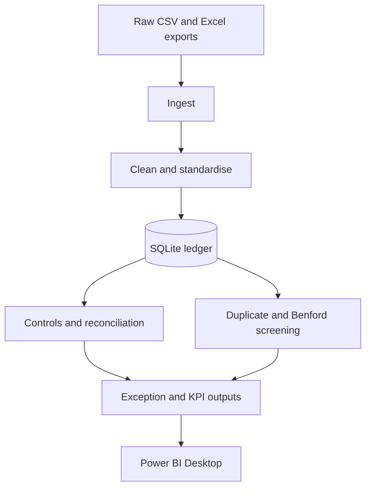

# UK Audit Analytics Portfolio: Ledger Data Quality

An independent audit-analytics portfolio project modelled on the questions that matter in a UK audit: can the financial data be relied upon, do key controls appear to operate, does the ledger reconcile, and where should the audit team focus further work? It turns mixed accounts-payable exports into a traceable SQLite ledger, control-test results, exception populations, and Power BI-ready files.

The data is synthetic and the project is not a Deloitte client engagement or a representation of any real organisation.

## Audit value

| Audit objective | Analytics performed | Decision support |
|---|---|---|
| Risk assessment | Profiles missing critical fields, orphan vendors, duplicate-payment candidates, and unusual first-digit distributions. | Focuses walkthroughs, substantive procedures, and discussions with process owners on higher-risk populations. |
| Controls testing | Tests transaction completeness, transaction-ID uniqueness, and vendor-master referential integrity. | Helps assess whether data-entry, interface, and master-data controls need further testing or remediation. |
| Financial-data reconciliation | Compares actual totals by GL account with independent control totals using a £0.01 tolerance. | Establishes whether the ledger population can be relied upon and identifies accounts requiring reconciliation. |
| Stakeholder decisions | Produces KPIs, exception-level data, reconciliation detail, and a concise findings report. | Gives finance leadership and those charged with governance an evidence-led basis for prioritising remediation. |

## Workflow



## Audit analytics coverage

| Procedure | What it tests |
|---|---|
| Completeness | Critical transaction ID, vendor, date, and amount fields are populated. |
| Uniqueness | Transaction IDs appear only once. |
| Referential integrity | Every populated vendor ID exists in the vendor master. |
| Reconciliation | Actual GL-account totals tie to independently generated control totals within £0.01. |
| Duplicate-payment screening | Vendor, invoice number, and amount combinations are repeated. |
| Benford screening | First-digit frequencies are compared with Benford's expected distribution. |

## Run locally

Python 3.11 or newer is recommended.

```bash
python -m venv .venv
source .venv/bin/activate  # Windows: .venv\Scripts\activate
python -m pip install -r requirements.txt
python -m src.run_pipeline
python -m pytest -q
```

The run is deterministic: fixed random seeds regenerate 10,150 synthetic transactions with deliberately planted missing fields, orphan vendor references, duplicate-payment candidates, reconciliation differences, and an elevated digit-9 pattern. Run against the existing raw exports without regenerating them with:

```bash
python -m src.run_pipeline --no-regen
```

## Findings and outputs

- [`outputs/EXECUTIVE_FINDINGS.md`](outputs/EXECUTIVE_FINDINGS.md) — concise audit findings, risk interpretation, and recommended follow-up actions.
- `data/processed/ledger.db` — generated local SQLite database (not committed).
- `outputs/kpis.csv` — dashboard KPI row.
- `outputs/exceptions_report.csv` — consolidated transaction-level exceptions.
- `outputs/benford.csv` — observed and expected first-digit frequencies.
- `outputs/reconciliation.csv` — GL-account control-total tie-out detail.
- `src/queries.sql` — five analyst queries for vendor spend, monthly trends, GL totals, duplicate payments, and orphan vendors.

## Power BI Desktop

[`outputs/DASHBOARD.md`](outputs/DASHBOARD.md) contains the manual Power BI Desktop build instructions. This repository includes the reproducible source CSVs only: it does **not** include a `dashboard.pbix` file or a dashboard screenshot. Create and save the report locally in Power BI Desktop after importing the generated outputs.

## Interpretation and limitations

- The data and findings are synthetic; they demonstrate an audit-analytics workflow rather than describe a real organisation.
- Duplicate matches are candidates for investigation, not confirmed duplicate payments.
- **Benford analysis is a screening method, not proof of fraud, error, or misconduct.** Interpret any unusual distribution with transaction-level evidence, business-process knowledge, and control evidence.
- The reconciliation tolerance is a demonstrative £0.01 and should be agreed with the engagement team for a real audit.
