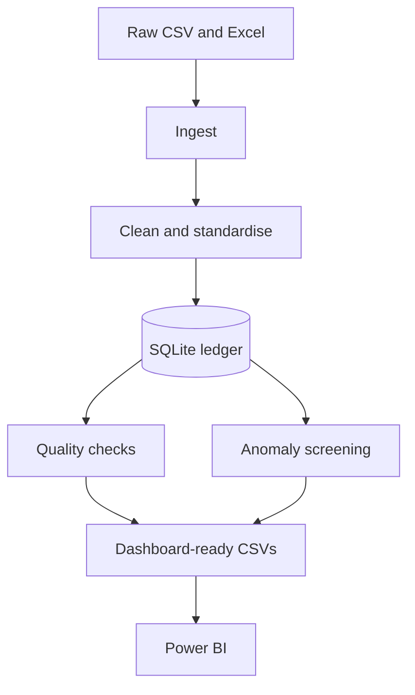

# Ledger Data Quality & Reconciliation Pipeline

An end-to-end Python and SQL portfolio project that turns inconsistent accounts-payable exports into a queryable, audit-friendly dataset. The pipeline ingests mixed CSV and Excel files, standardises financial fields, loads SQLite, runs automated control checks, screens duplicate payments and unusual first-digit patterns, and produces dashboard-ready outputs for Power BI.

## Architecture



## Controls implemented

| Control | What it tests |
|---|---|
| Completeness | Critical transaction ID, vendor, date, and amount fields are populated. |
| Uniqueness | Transaction IDs appear only once. |
| Referential integrity | Every populated vendor ID exists in the vendor master. |
| Reconciliation | Actual GL totals tie to independently generated control totals within £0.01. |
| Duplicate payments | Vendor, invoice number, and amount combinations are repeated. |
| Benford screening | First-digit frequencies are compared with Benford's expected distribution. |

## Run locally

Python 3.11 or newer is recommended.

```bash
python -m venv .venv
source .venv/bin/activate  # Windows: .venv\Scripts\activate
pip install -r requirements.txt
python -m src.run_pipeline
python -m pytest -q
```

The run is deterministic: fixed random seeds regenerate 10,150 synthetic transactions with planted missing fields, orphan vendor references, duplicate-payment candidates, reconciliation differences, and a digit-9 anomaly.

Run against the existing raw exports without regenerating them:

```bash
python -m src.run_pipeline --no-regen
```

## Outputs

- `data/processed/ledger.db` — local SQLite database (generated, not committed).
- `outputs/kpis.csv` — dashboard KPI row.
- `outputs/exceptions_report.csv` — consolidated transaction-level exceptions.
- `outputs/benford.csv` — observed versus expected digit frequencies.
- `outputs/reconciliation.csv` — GL tie-out detail.
- `src/queries.sql` — five analyst queries for vendor spend, monthly trends, GL totals, duplicate payments, and orphan vendors.

See [`outputs/DASHBOARD.md`](outputs/DASHBOARD.md) for the Power BI build guide. After building the report in Power BI Desktop, save it as `outputs/dashboard.pbix` and add a screenshot to this README.

## Example findings

The deterministic dataset is expected to produce 130 rows with missing critical fields, 79 orphan-vendor rows, six GL reconciliation breaks, and 290 duplicate-payment candidate rows. Transaction-ID uniqueness passes because the planted payment duplicates use distinct IDs. The overall Benford mean absolute deviation remains close, while digit 9 is visibly elevated relative to its expected frequency.

## Limitations

- The data is synthetic and the issues are deliberately injected; results demonstrate the workflow rather than describe a real organisation.
- Duplicate matches are candidates for investigation, not confirmed duplicate payments.
- Benford's Law is a screening heuristic, not proof of error or fraud. Suitability depends on the source population and business process.
- The `.pbix` report must be assembled in Power BI Desktop using the reproducible output files.
