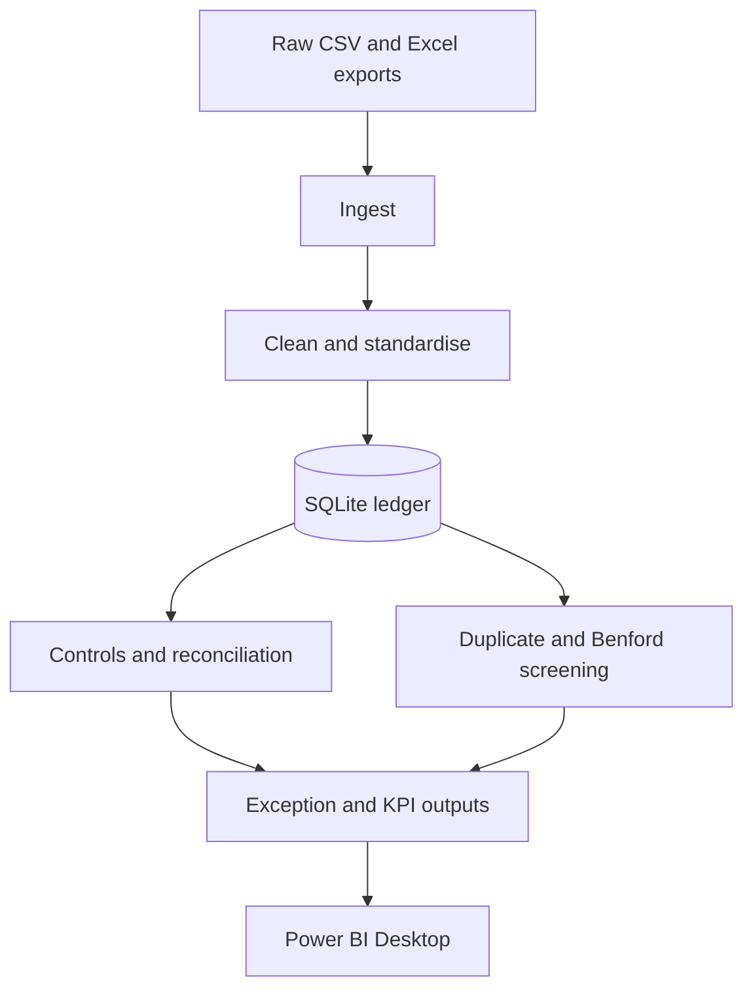

# Ledger Data Quality — Python + SQL Reconciliation & Analytics Pipeline

> **Audit/data-quality pipeline turning mixed financial exports into a controlled, traceable ledger and exception workflow.** The project regenerates **10,150 synthetic transactions**, standardises them into SQLite, runs completeness/uniqueness/referential-integrity controls, screens duplicate-payment candidates and Benford distributions, reconciles GL totals to independent controls using a **£0.01 tolerance**, and produces KPI and exception outputs for analysis.

`Python` · `SQL` · `SQLite` · `pandas` · `Reconciliation` · `Benford Screening` · `Data Controls` · `Power BI Ready`

[](https://python.org)
[](https://github.com/NathS04/ledger-data-quality/actions/workflows/ci.yml)
[](LICENSE)

> **Disclaimer:** This project processes **synthetic financial data** with injected defects for portfolio and analytical demonstration purposes. It is not a Deloitte or client engagement. Benford's Law and duplicate checks serve as analytical **screening tools** to prioritize human investigation, not direct proof of fraud.

---

## 20-second project view

| Dimension | Details |
| :--- | :--- |
| **Input Data** | Disjoint CSV, Excel, and legacy financial exports (10,150 synthetic transactions with realistic data defects). |
| **Pipeline Architecture** | Python ingestion → standardisation & cleansing → SQLite database → data quality & control testing → anomaly detection → exception reporting. |
| **Data Controls** | Completeness (>95% threshold), uniqueness (transaction ID deduplication), referential integrity (vendor master reconciliation). |
| **Reconciliation** | Period ledger balance check reconciled against independent control totals within a strict **£0.01 tolerance**. |
| **Analytics & Screening** | Duplicate-payment candidate detection (vendor + amount + 3-day window) & Benford's Law leading-digit chi-square screening. |
| **Reporting Outputs** | Structured exception CSVs, executive KPI metrics, Benford frequency breakdown, and Power BI-ready data models. |

---

## Why this matters

> **Technical data controls convert raw financial exports into decision-grade information.**

In technical consulting and solutions engineering, clients rarely present clean, ready-to-use data. The core challenge is not merely writing SQL queries, but building automated controls that verify data integrity, reconcile disjoint sources, and highlight exact operational anomalies so analysts and auditors know precisely where to investigate.

---

## Workflow



---

## Audit & Analytics Value

| Audit objective | Analytics performed | Decision support |
|---|---|---|
| **Risk assessment** | Profiles missing critical fields, orphan vendors, duplicate-payment candidates, and unusual first-digit distributions. | Focuses walkthroughs, substantive procedures, and discussions with process owners on higher-risk populations. |
| **Controls testing** | Tests transaction completeness, transaction-ID uniqueness, and vendor-master referential integrity. | Helps assess whether data-entry, interface, and master-data controls need further testing or remediation. |
| **Financial-data reconciliation** | Compares actual totals by GL account with independent control totals using a £0.01 tolerance. | Establishes whether the ledger population can be relied upon and identifies accounts requiring reconciliation. |
| **Stakeholder decisions** | Produces KPIs, exception-level data, reconciliation detail, and a concise findings report. | Gives finance leadership and those charged with governance an evidence-led basis for prioritising remediation. |

---

## Audit Analytics Coverage

| Procedure | What it tests |
|---|---|
| **Completeness** | Critical transaction ID, vendor, date, and amount fields are populated. |
| **Uniqueness** | Transaction IDs appear only once. |
| **Referential integrity** | Every populated vendor ID exists in the vendor master. |
| **Reconciliation** | Actual GL-account totals tie to independently generated control totals within £0.01. |
| **Duplicate-payment screening** | Vendor, invoice number, and amount combinations are repeated. |
| **Benford screening** | First-digit frequencies are compared with Benford's expected distribution. |

---

## Quickstart & Local Execution

Python 3.11 or newer is recommended.

```bash
git clone https://github.com/NathS04/ledger-data-quality.git
cd ledger-data-quality

python -m venv .venv
source .venv/bin/activate  # Windows: .venv\Scripts\activate
python -m pip install -r requirements.txt
python -m src.run_pipeline
python -m pytest -q
```

The run is deterministic: fixed random seeds regenerate 10,150 synthetic transactions with deliberately planted missing fields, orphan vendor references, duplicate-payment candidates, reconciliation differences, and an elevated digit-9 pattern. Run against the existing raw exports without regenerating them with:

```bash
python -m src.run_pipeline --no-regen
```

---

## Findings and Outputs

- [`outputs/EXECUTIVE_FINDINGS.md`](outputs/EXECUTIVE_FINDINGS.md) — concise audit findings, risk interpretation, and recommended follow-up actions.
- `data/processed/ledger.db` — generated local SQLite database (not committed).
- `outputs/kpis.csv` — dashboard KPI row.
- `outputs/exceptions_report.csv` — consolidated transaction-level exceptions.
- `outputs/benford.csv` — observed and expected first-digit frequencies.
- `outputs/reconciliation.csv` — GL-account control-total tie-out detail.
- `src/queries.sql` — analyst queries for vendor spend, monthly trends, GL totals, duplicate payments, and orphan vendors.

---

## Power BI Desktop Integration

[`outputs/DASHBOARD.md`](outputs/DASHBOARD.md) contains the step-by-step Power BI Desktop build instructions. This repository includes the reproducible source CSVs for reporting. Connect Power BI Desktop to `outputs/kpis.csv`, `outputs/exceptions_report.csv`, and `outputs/benford.csv` or directly to `data/processed/ledger.db`.

---

## Interpretation and Limitations

- The data and findings are synthetic; they demonstrate an audit-analytics workflow rather than describe a real organisation.
- Duplicate matches are candidates for investigation, not confirmed duplicate payments.
- **Benford analysis is a screening method, not proof of fraud, error, or misconduct.** Interpret any unusual distribution with transaction-level evidence, business-process knowledge, and control evidence.
- The reconciliation tolerance is a demonstrative £0.01 and should be agreed with the engagement team for a real audit.

---

## Related Portfolio Work

- [Policy Copilot](https://github.com/NathS04/policy_copilot_submission) — Audit-Ready RAG with Citation Enforcement & Evaluation Harness
- [EventHub](https://github.com/NathS04/comp3011-cw1-api) — Production-Style FastAPI Event API with 24 REST Endpoints & Provenance Tracking
- [Search Engine Tool](https://github.com/NathS04/comp3011-cw2-api) — Web Crawler, Positional Inverted Index & TF-IDF Ranking Engine

